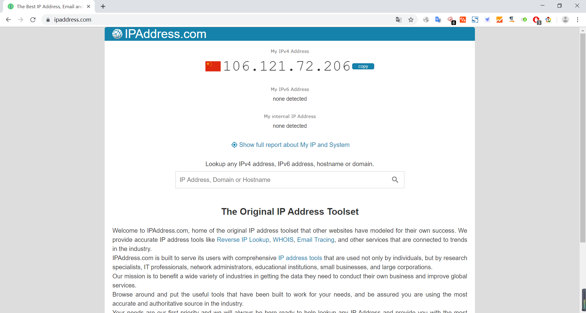
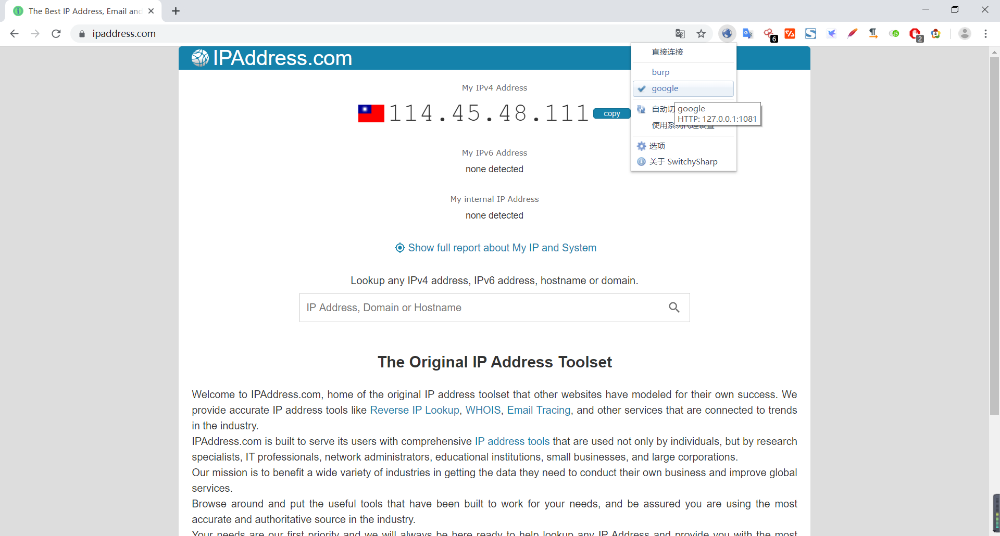
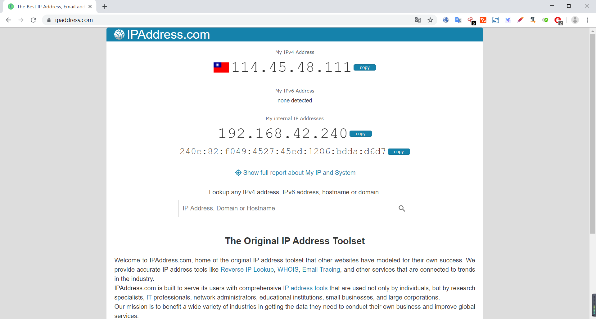
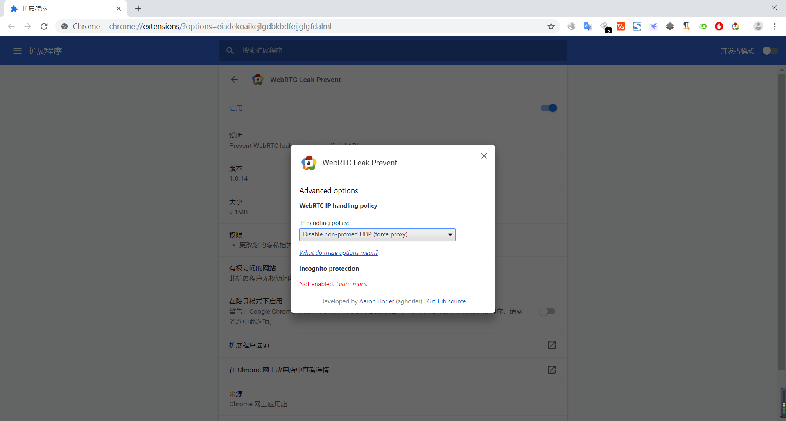
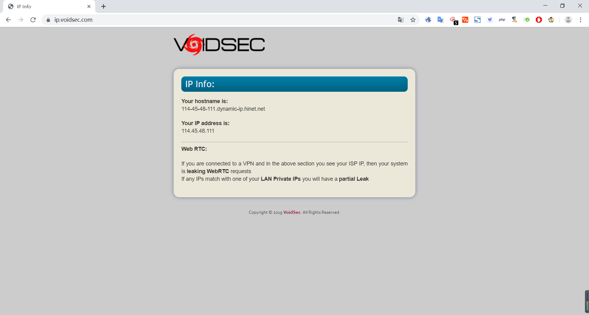

# 全局代理下隐藏IP

WebRTC（网页即时通信，Web Real-Time Communication） WebRTC，名称源自网页即时通信（Web Real-Time Communication）的缩写，是一个支持网页浏览器进行实时语音对话或视频对话的API。包括 Chrome、Firefox、Opera、Safari 均支持，并且在移动端也有支持。WebRTC 漏洞的可怕之处在于，即使你用 VPN 全局代理上网仍然会暴露自己的真实 IP 地址。

真实IP：  
  
代理之后的IP：  
  
通过WebRTC获取真实IP：  
  
使用装「WebRTC Leak Prevent」扩展插件进行隐藏IP：  
  
  