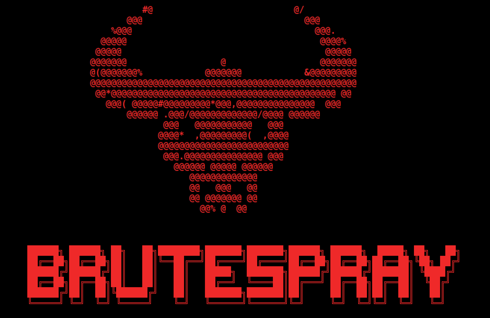
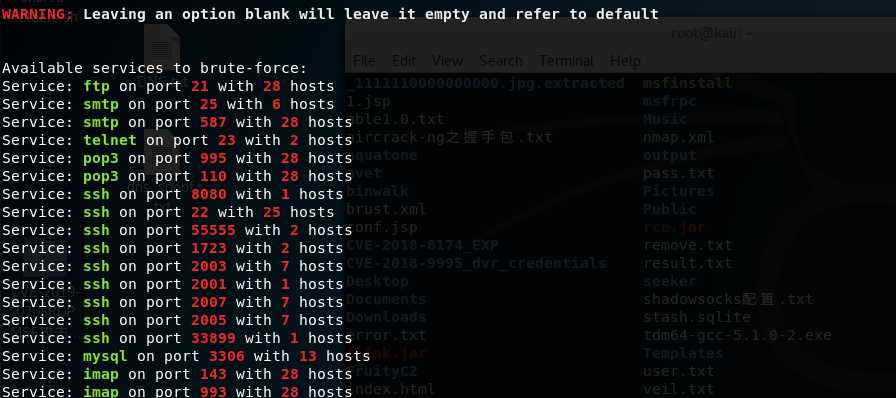

# 基于服务的爆破nmap+BrutesPray

## 目前大众化的爆破攻击都是基于端口和服务的爆破

比如:
```
medusa
hydra
nmap
SNETCracker
```
都需指定端口然后对应服务，接着开始爆破，对于批量IP，改了大量默认端口的爆破就显得很鸡肋

## BrutesPray
  
BrutesPray自动调用Medusa对服务进行爆破，成功的解决了这一问题，实现了基于服务的爆破  

kali安装：
```
apt-get install BrutesPray
```
使用方法：
```
nmap -A -sV -oX 192.168.1.1/24               # 核心参数是-sV识别服务和-oX保存为xml或-oG保存为Gnmap
BrutesPray -f nmap.xml –i -o output	         # 进入交互式，可以指定字典、服务、线程、是否爆破一个账户等，结果保存至output文件夹下
```
如图识别出ssh在9个不同的端口运行  
